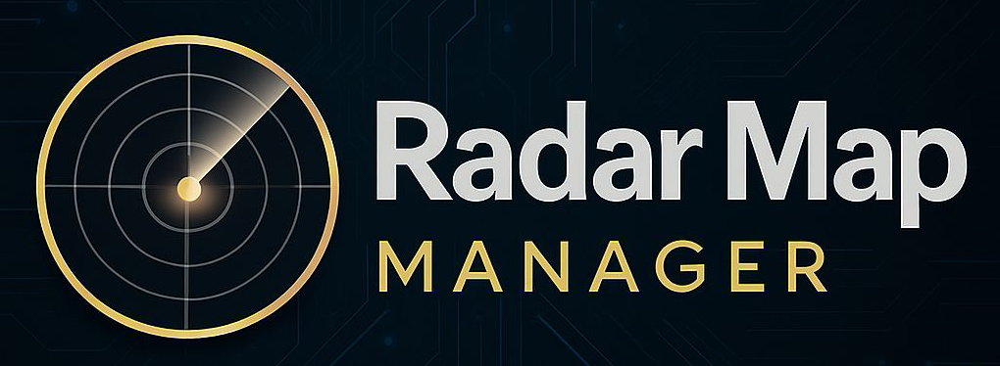

# Radar Map Manager (RMM)



[](https://github.com/hacs/integration)

> 🇨🇳 **Chinese User?** [Click here for Chinese Documentation](README_zh.md)

**Radar Map Manager (RMM)** is a millimeter-wave radar visualization and data fusion integration built specifically for Home Assistant.

It is not just a floor plan card, but a **spatial perception engine**. RMM maps data from multiple scattered millimeter-wave radars in your home onto one or more floor plans, enabling whole-house human tracking, trajectory visualization, and precise coordinate-based automation.

> 🚀 **V1.0.0 Officially Released!**

---

## ✨ Core Features

### 1. 🎯 WYSIWYG Visual Editor
Ditch the tedious YAML coordinate calculations! RMM provides an interactive frontend editor:
* **Config/View Modes**: Supports **Config Mode** and **Read-Only Mode**, allowing for both easy setup and clean display.
* **Multi-Map/Multi-Floor Support**: Manage multiple floors and locations easily with **`map_group`**, creating independent views for your home or office.
* **Flexible Radar Configuration**: Drag and drop radar positions directly on the floor plan. Supports rotation, scaling, and mirroring for one-stop management.
* **Automatic Positioning & Scaling**: With the **Freeze** function, you can visually locate a radar target relative to the floor plan to easily adjust the radar scaling—goodbye to blind guessing.
* **Mounting Styles**: Perfectly supports both **Side Mount** and **Ceiling Mount** radars.

### 2. 🌐 Multi-Radar Sensor Fusion
RMM's target fusion engine unifies target points from multiple radars into a single coordinate system:
* **Auto-Clustering**: Merges data when multiple radars detect the same person to prevent "ghost targets." Supports custom fusion ranges.
* **Blind Spot Compensation**: Eliminates detection dead zones in rooms by overlapping multiple radars.

### 3. 🛡️ Flexible Zone Management
Supports arbitrary polygons with flexible editing, making zone management easy:
* **Radar Monitor Zones**: Set individual monitor zones for each radar. Targets are only fused and displayed if they enter this zone; otherwise, global fusion is used by default.
* **Global Detect Zones**: **Automation Powerhouse!** Freely set detection zones on the floor plan. When a fused target enters these zones, HA entities (automatically generated) are triggered. You can also customize trigger delays to avoid false alarms.
* **Global Exclude Zones**: **The False Alarm Killer!** Draw zones around fans, curtains, or plants. The engine automatically filters out all interference signals within these areas.
* **Automation Entities**: Each Global Detect Zone automatically generates a **Presence entity (`binary_sensor`)** and a **Count entity (`sensor`)**, letting you know if someone is there and how many people are present. Easily implement automations like "Person on sofa turns on TV" or "Person enters bathroom area adjusts lights."

### 4. 📐 3D Spatial Correction
For side-mounted radars, RMM features a built-in 3D geometric correction algorithm. It automatically converts Slant Range to Ground Distance based on installation height and target height, significantly improving positioning accuracy.

---

## 🛠️ Supported Hardware

RMM is compatible with any millimeter-wave radar integrated into Home Assistant (including 1D, 2D, and 3D radars), as long as they provide `DISTANCE` or `X/Y` coordinate data.

* **Connection Methods**:
    * ESPHome
    * MQTT
    * Zigbee (Must support coordinate reporting)

* **Entity Naming Convention** ‼️ IMPORTANT ‼️ :
To ensure the system correctly identifies radar data, please follow these naming formats:

* **1D Radar**: `sensor.[radar_name]_distance`
  * *Example: `sensor.rd_ld2410_distance`*
* **2D/3D Radar**: `sensor.[radar_name]_target_?_x`
  * *Must include: `_x`, `_y`, `_z` coordinates*
  * *Example: `sensor.rd_ld6004_target_1_x`*
* **Radar Target Count [Optional]**: `sensor.[radar_name]_presence_target_count`
  * *Example: `sensor.rd_ld2450_presence_target_count`*

---

## 📦 Installation

### Method 1: HACS Automatic Installation (Recommended)
1.  Open HACS -> Integrations.
2.  Click the top-right menu -> **Custom repositories**.
3.  Enter the repository URL: `https://github.com/Moe8383/radar_map_manager_repo`, select category **Integration**.
4.  Search for "Radar Map Manager" and click install.
5.  Restart Home Assistant.

### Method 2: Manual Installation
1.  Download the `custom_components/radar_map_manager` folder from this repository.
2.  Copy it to your Home Assistant's `custom_components/` directory.
3.  Restart Home Assistant.

---

## ⚙️ Configuration Guide

### Step 1: Add Integration
1.  Go to **Settings** -> **Devices & Services** -> **Add Integration**.
2.  Search for **Radar Map Manager** and add it.

### Step 2: Add Card
1.  On your dashboard, click "Edit Dashboard" -> "Add Card".
2.  Search for the **Radar Map Manager** card.
3.  Or use the following YAML configuration:

**Standalone Use (Manual Card):**
```yaml
type: custom:radar-map-card
map_group: default                   # Optional, floor plan/map group name, default: default
read_only: false                     # Optional, true for view mode, false for edit mode, default: false
bg_image: /local/floorplan/house.png # Required in edit mode, path to floor plan image
target_radius: 5                     # Optional, size of the fused target dot
show_labels: true                    # Optional, show zone names
handle_radius: 1.5                   # Optional, size of edit handles
handle_stroke: 0.2                   # Optional, border size of active handles
zone_stroke: 0.5                     # Optional, zone line width
label_size: 2                        # Optional, font size for zone names
target_colors:                       # Optional, custom colors for raw radar targets
  - yellow
  - "#00FFFF"
  - "#FF00FF"
```

### Step 3: Start Editing
Click the ⚙️ (Gear) icon on the card to enter Edit Mode.

Add Radar: Click Layout -> + and select your radar entity.

Adjust: Drag the radar, adjust Rotation and Scale to match your floor plan.

Draw Zones: Switch to Zones mode to draw polygons for automation triggers.

---

🔜 Roadmap
We are committed to creating the ultimate radar experience. Future plans include:

Auto-Calibration: "One-click map alignment" using IMU (requires upcoming RMM Pro hardware).

High-Frequency Mode: Unlock 20Hz+ silky-smooth tracking with custom firmware.

Edge Computing: Offload zone processing to hardware for zero-latency automation.

---

❤️ Support
If you find this project helpful, please give it a ⭐️ Star!

[](https://www.buymeacoffee.com/moe8383)
[](https://afdian.com/a/moe8383)

Bugs: Please open an Issue.

Discussions: Share your setup in the Discussions tab.

License: MIT


